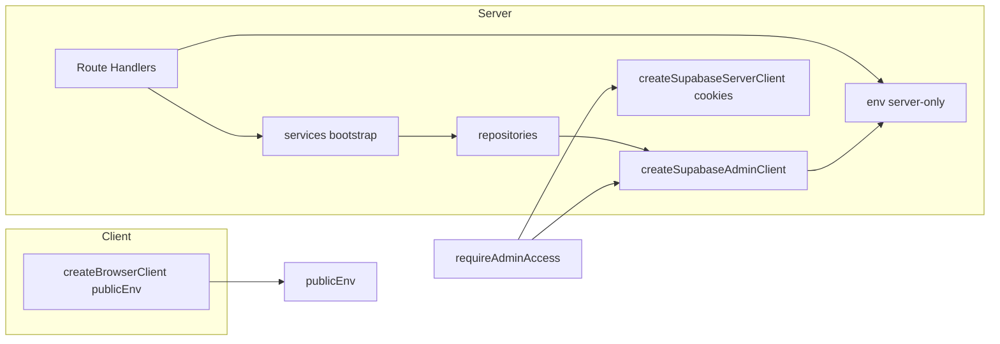

<!-- BEGIN:nextjs-agent-rules -->
# This is NOT the Next.js you know

This project uses **Next.js 16.2** (not older major versions). APIs, conventions, and file structure may differ from training data. Before writing or refactoring Next.js code, read the relevant guide under `node_modules/next/dist/docs/` and heed deprecation notices.
<!-- END:nextjs-agent-rules -->

# RiBuzz — agent playbook

Single source of truth for coding agents working on this repository. **Setup humano** (env, Supabase, Docker, desarrollo): [README.md](README.md). **Referencia HTTP de la API** (rutas, cuerpos, auth, admin, errores, variables que afectan endpoints): [docs/API.md](docs/API.md) — mantenerla al dia al tocar `src/app/api/**`.

## Project identity

- **RiBuzz** public marketing site (Spanish-first copy for user-facing strings where applicable).
- Code and comments may mix English and Spanish to match existing files.

## Stack

| Layer | Choice |
|--------|--------|
| Framework | Next.js App Router (`src/app/`) |
| Runtime UI | React 19 |
| Language | TypeScript (`strict`) |
| Styling | Tailwind CSS 4 |
| Validation | Zod 4 |
| Backend / data | Supabase (`@supabase/ssr`, `@supabase/supabase-js`) |
| Motion / 3D | Framer Motion, GSAP, Three.js (use only where the feature already does) |

Path alias: `@/*` → [`src/`](src/) (see [`tsconfig.json`](tsconfig.json)).

## Directory map

| Path | Role |
|------|------|
| [`src/app/`](src/app/) | Routes, layouts, `api/**/route.ts` (incluye [`src/app/api/auth/`](src/app/api/auth/) para Supabase Auth) |
| [`src/components/`](src/components/) | UI — `layout/`, `sections/`, `ui/`, `interactive/` |
| [`src/lib/`](src/lib/) | `env`, Supabase factories, API helpers, Zod schemas, security utilities |
| [`src/services/`](src/services/) | Application orchestration; [`bootstrap.ts`](src/services/bootstrap.ts) wires repositories and services |
| [`src/repositories/`](src/repositories/) | Data access using the **Supabase admin** (service role) client |
| [`src/types/database.ts`](src/types/database.ts) | `Database` types for Supabase; update when the schema changes |
| [`supabase/migrations/`](supabase/migrations/) | SQL migrations (apply via CLI or Supabase SQL editor — see README) |
| [`docs/API.md`](docs/API.md) | Referencia de la API HTTP (`src/app/api/**`): metodos, payloads, seguridad |

## Environment variables

**Server-only** — [`src/lib/env.ts`](src/lib/env.ts) imports `server-only` and parses secrets and tunables with Zod. Required for full server boot: `NEXT_PUBLIC_SUPABASE_*`, `SUPABASE_SERVICE_ROLE_KEY`, `INTERNAL_ADMIN_API_KEY` (min length enforced). Turnstile: `TURNSTILE_SECRET_KEY` and `NEXT_PUBLIC_TURNSTILE_SITE_KEY` must both be set or both empty.

**Client-safe** — [`src/lib/public-env.ts`](src/lib/public-env.ts) exposes only `NEXT_PUBLIC_*` values safe for the browser bundle.

**Rules**

- Never import `env` from `"use client"` components or any code shipped to the browser.
- Never expose `SUPABASE_SERVICE_ROLE_KEY` or `INTERNAL_ADMIN_API_KEY` to the client.

## Supabase: three clients

1. **Admin (service role)** — [`src/lib/supabase/admin.ts`](src/lib/supabase/admin.ts): `createSupabaseAdminClient()`. Server-only. Used by repositories and `createBackendServices()`. Bypasses RLS by design; keep usage inside server-side services.

2. **Server (anon + cookies)** — [`src/lib/supabase/server.ts`](src/lib/supabase/server.ts): `createSupabaseServerClient()`. For cookie-bound server usage and RLS-aware access where appropriate.

3. **Browser (anon)** — [`src/lib/supabase/client.ts`](src/lib/supabase/client.ts): `getSupabaseBrowserClient()`, `"use client"`, uses `publicEnv` only.

## Admin API access

[`src/services/admin-access-service.ts`](src/services/admin-access-service.ts) — `requireAdminAccess(request)`:

- **Internal key**: `Authorization: Bearer <INTERNAL_ADMIN_API_KEY>` or header `x-admin-api-key` matching [`env`](src/lib/env.ts). Actor role `system`.
- **Supabase session**: Valid server session plus an active row in `public.admin_profiles` (loaded via admin client). Roles: `owner`, `admin`, `reviewer`, etc.

Use `requireAdminAccess` on admin route handlers before listing or mutating sensitive data.

**Auth HTTP API** — Rutas bajo `src/app/api/auth/`. Contrato y ejemplos: [docs/API.md](docs/API.md). Implementacion: [`src/services/auth-service.ts`](src/services/auth-service.ts), esquemas: [`src/lib/schemas/auth.ts`](src/lib/schemas/auth.ts).

## API route pattern

Typical public handler (see [`src/app/api/diagnostic-request/route.ts`](src/app/api/diagnostic-request/route.ts)):

1. Derive client IP ([`src/lib/security/request.ts`](src/lib/security/request.ts)).
2. Apply in-memory rate limit ([`src/lib/security/rate-limit.ts`](src/lib/security/rate-limit.ts)) using `env` tunables where relevant.
3. Parse JSON body; validate with a schema from [`src/lib/schemas/`](src/lib/schemas/).
4. Optional: Cloudflare Turnstile ([`src/lib/security/turnstile.ts`](src/lib/security/turnstile.ts)).
5. Call `createBackendServices()` from [`src/services/bootstrap.ts`](src/services/bootstrap.ts) and invoke the appropriate service.
6. Respond with [`apiOk`](src/lib/api/response.ts) / [`apiError`](src/lib/api/response.ts) / [`handleRouteError`](src/lib/api/response.ts); structured errors via [`ApiError`](src/lib/api/errors.ts).
7. Update [docs/API.md](docs/API.md) when the route’s contract (method, path, body, query, headers, or notable behavior) changes.

Admin routes additionally call `requireAdminAccess` first (see [`src/app/api/admin/diagnostic-requests/route.ts`](src/app/api/admin/diagnostic-requests/route.ts)).

## Security checklist (agents)

- Respect rate limits and existing honeypot / Turnstile flows when touching public lead endpoints.
- Assume RLS on sensitive tables; do not rely on public table exposure for leads.
- Do not log secrets, tokens, or full service role keys.
- New tables/columns: add migration SQL and align [`src/types/database.ts`](src/types/database.ts).

## Commands

```bash
npm install
npm run dev
npm run build
npm run lint
npm run test:supabase          # conectividad usando .env.local / .env
npm run test:supabase:docker   # contra API en 127.0.0.1:54321 (tras supabase start)
```

Docker production-style preview: see [README.md](README.md).

## When editing

- Prefer extending existing services and repositories over new ad hoc Supabase calls in route files.
- Add or extend Zod schemas for new request/query shapes.
- After schema changes, update types and migrations together.
- Run `npm run lint` and `npm run build` before considering work complete.

## Architecture sketch


